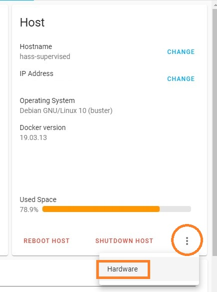
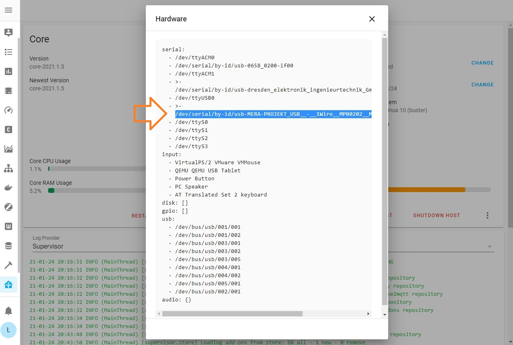
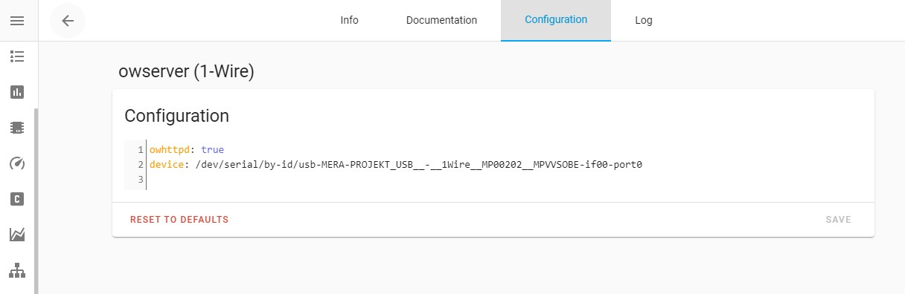

# owserver

The addon provide owserver to read 1-Wire devices over DS2480B-based bus master serial device

## Installation

1. Access your Home Assistant, go to **Supervisor** -> **Add-on Store** and add this URL as an additional repository: `https://github.com/lrybak/hassio-addons/repository`
2. Find the "owserver (1-Wire)" add-on and click the "INSTALL" button.
3. Configure the add-on and click on "START". With default configuration addon starts with fake (mocked) devices.
4. Add to Home Assistant through the Integrations. Go to Integrations, Add Integration, Choose 1-Wire, Connection type: OWServer, Host: 9e0ef242-owserver, Port 4304 (default).
5. That's it. On the integrations page wou will find 1-Wire integration with discovered devices.

## Configuration

**Note**: _Remember to restart the add-on whenever configuration change._

Example add-on configuration:

```yaml
owhttpd: true
device: ''
```

### Option: `owhttpd`

Enable to start the embedded owhttpd server (Default true).
owhttpd server is exposed via **Ingress (Open Web UI)**

### Option: `device`

Specify DS2480B-based bus master. 
To can find your device go to **Supervisor** -> **System** -> **Host System** -> click three dots -> **Hardware**
Keep it empty '' to mock with FAKE device





## Home Assistant integration

1. Configure and start addon. With default configuration addon starts with fake (mocked) devices.
2. Add to Home Assistant through the Integrations. Go to Integrations, Add Integration, Choose 1-Wire, Connection type: OWServer, Host: 9e0ef242-owserver, Port 4304 (default).
3. That's it. On the integrations page wou will find 1-Wire integration with discovered devices.